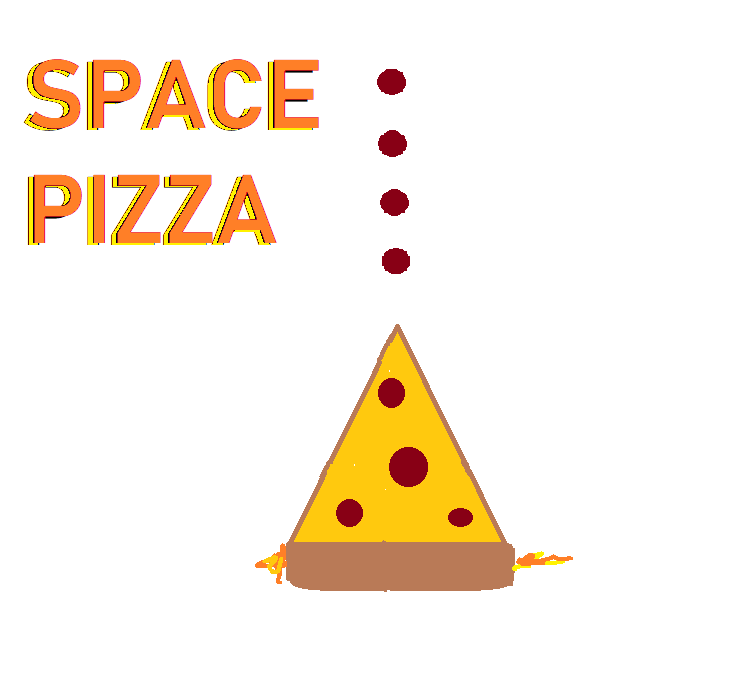
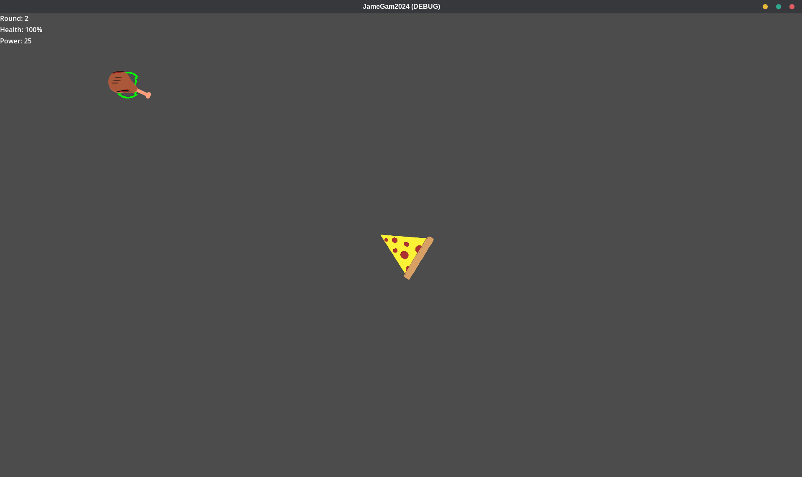
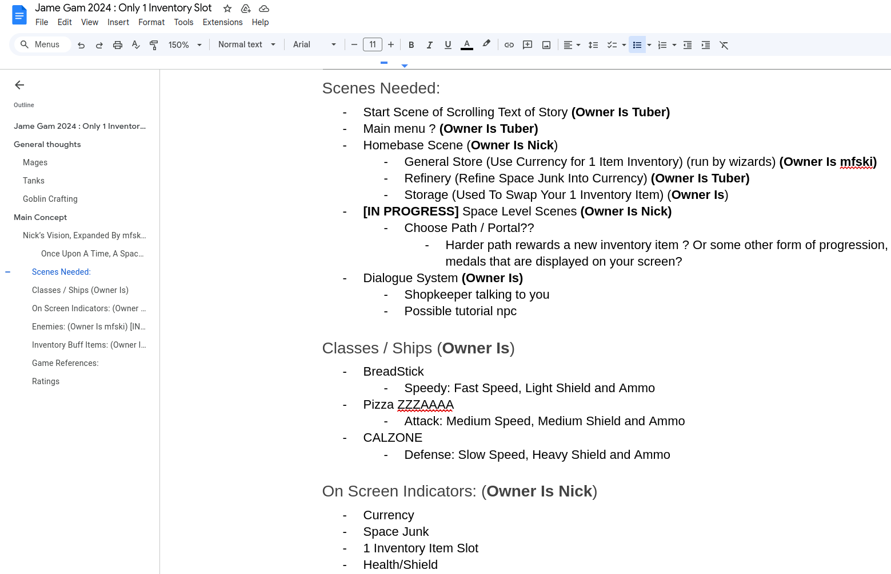
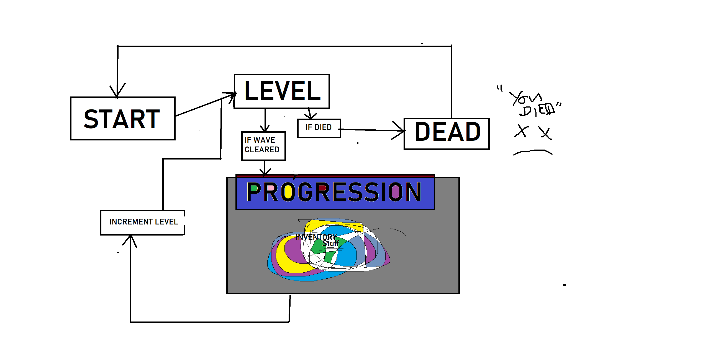

# JameGam2024 - Space Pizza

## Once Upon a Time, a Space Game Inspired by Asteroid With Rogue-Like Gameplay Happened... Or Did It? Space Pizza (Suh, Not ZA)

*This journey begins* with three enterprise software developers with backgrounds in Manufacturing, Banking, and Defense. Our most familiar languages are C#, Javascript, and Go, with only a little bit of experience with Unity. Before this Game Jam we hadn't worked together before, and this was our first Game Jam. We chose Godot 4 and tried to use as much GDScript as possible. We didn't "succeed" with the game we designed several times as a team, but we learned a lot from installing Godot 4 on Linux to delivering a prototype game on itch.io.

### What Is Space Pizza?

Initially, the game started as a robot builder, then a robot fighter, and lastly, ended up with an astroid space-like game, but we wanted to throw a spin on it. We landed here because when making a Sprite2D move through infinite space was oddly addicting, and so we decided to double down on that free feeling we got versus building/fighting robots. Here are some of the high-level concepts we designed:

- Start at the home base, in a safe area with different buildings: refinery, general store, and storage.

- Use portals on your home base that teleport you to the space levels.
	
- Fight food enemies as a pizza ship shooting pepperonis.
	
- Currency is generated by killing enemies and collecting space junk, which needs to be refined at the refinery.
    
- Upgrade your pizza ship or try a different model out at the General Store (breadstick/calzone/stromboli)

So, where did we go wrong? We downplayed the learning curve and spent too much time in creativity land (We created audio and graphic assets from scratch and never used them in the game). Since we started without prior art or experience, we overdesigned, letting our imagination go wild and defining things we should've waited on. However, we didn't let these challenges discourage us. We did our best, and it was the most fun part of the Game Jam.

### What Did We Learn About Designing a Game?

1. For every entity, mechanic, or system/sub-system, an owner should be assigned and owned from start to finish. Otherwise, scope creep will happen, and if you've never worked together before, it's wise to set expectations for yourself and everyone else on the team, especially when working in async-comms mode.

2. Before code is written, choose a version control branching strategy, have one person start the project, create some scaffolding, and commit to the main branch. Developers pull from the main branch to develop their features and pull requests back to the main. With only around 50 commits and 10 PRs, we only ran into some merge conflicts or hassles following mostly git-flow.

3. With a limited time frame, you don't get caught up with productivity tooling or complex workflows. We used one Google doc to design, assign, and track the work's status planned in the Space Pizza jam kick-off and Discord to coordinate/work on things. Lastly, it's okay to pivot based on learnings; we did it three times to match our strengths as we worked out our learnings and team dynamic kinks.

### What Did We Learn About Godot?

1. Godot was easy to install, even on Ubuntu 24.04. It was as easy as `sudo snap install godot4-mono && godot4-mono -e`. 

2. After installing, setting up a scene and resources, creating scripts, attaching them to nodes/resources, and creating dependencies in the visual editor was simple. Still, there was a learning curve around scenes and how to test a scene separately from other pieces/transitions of the game.

3. Many examples of Godot (*GitHub/YouTube/Godot Docs*) exist. Still, there is also a lot of older, incompatible Godot 3 code (code migration is available, but it might need some LLM magic to help).

4. It probably would've been better to copy an existing project and start tweaking/extending from there instead of learning from scratch. Of course, it's more of a learning experience. Still, there were times when we were hesitant about project structure, especially without stepping on each other's toes and without much experience. We also struggled initially with boundaries and infinite scrolling parallax-type backgrounds.

### Some of the Resources We Used

- **Godot 4 Docs** - https://docs.godotengine.org/en/stable/getting_started/first_2d_game/index.html#doc-your-first-2d-game

- **Godot 4 Example Code** - https://github.com/godotengine/godot-demo-projects/tree/master/2d 

- **Godot 4 Asteroids Tutorial YT Playlist** - https://youtube.com/playlist?list=PLhXFaKLHQJdXaLpoAcxOBV7romfeSgnqB&si=-Cqkv5a5OLoed7G7

- **Godot 4 Asteroids Tutorial Code** - https://github.com/KaanAlpar/asteroids_tutorial

### Here Are the Tools We Used for This Game Jam

- **Game Engine**: Godot 4 Mono

- **Platforms**: GitHub, Google Docs, Discord

- **Audio**: Audacity

- **Graphics**: draw.io, GIMP, MS Paint

### Team

**The Legend**: @fi0rini

**Tuber Man**: @DerekGooding

**Bro Ski**: @marshyski

### Design Artifacts:

